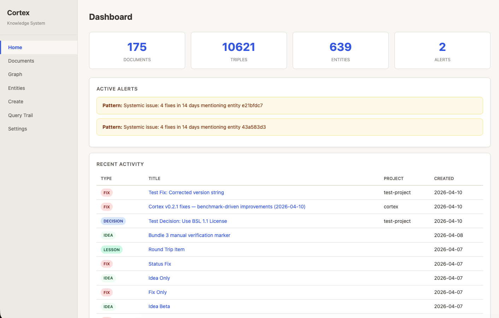
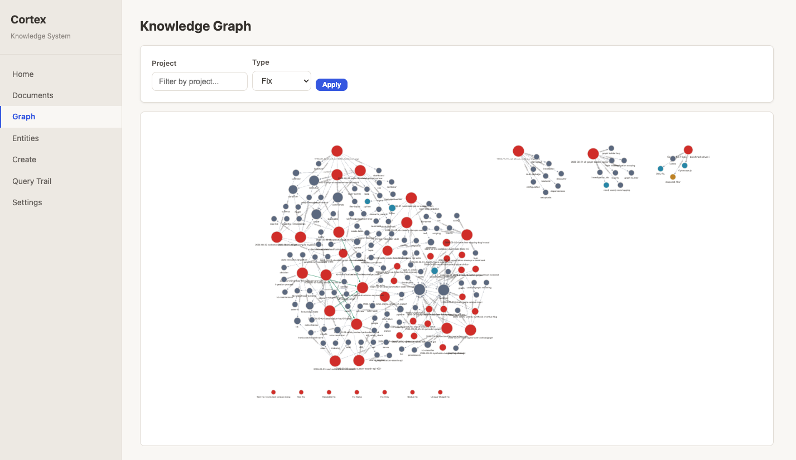

# Cortex

<!-- mcp-name: io.github.abbacusgroup/cortex -->

[](https://github.com/abbacusgroup/Cortex/actions/workflows/test.yml)
[](https://pypi.org/project/abbacus-cortex/)
[](https://pypi.org/project/abbacus-cortex/)
[](LICENSE)

Cognitive knowledge system with formal ontology, reasoning, and intelligence serving.

Cortex captures knowledge objects (decisions, lessons, fixes, sessions, research, ideas), classifies them with an OWL-RL ontology, discovers relationships, reasons over the graph, and serves intelligence through hybrid retrieval.





## Install

```bash
# Full install (semantic + keyword search)
pip install abbacus-cortex[embeddings]

# Lightweight (keyword search only, no PyTorch)
pip install abbacus-cortex

# From source
git clone https://github.com/abbacusgroup/Cortex.git
cd Cortex
uv sync --extra embeddings
```

## Quick Start

```bash
# 1. Initialize — creates ~/.cortex/, loads ontology, warms up embedding model
cortex init

# 2. Install background services (auto-start on login)
cortex install

# 3. Register with Claude Code
cortex register

# 4. Use
cortex capture "Fix: Neo4j pool exhaustion" --type fix --content "Root cause was..."
cortex search "Neo4j"
cortex list
cortex context "Neo4j"
cortex dashboard                    # web UI at http://localhost:1315
```

## Configuration

Set via environment variables (prefix `CORTEX_`) or `.env` file:

```env
CORTEX_DATA_DIR=~/.cortex
CORTEX_LLM_MODEL=claude-sonnet-4-20250514
CORTEX_LLM_API_KEY=sk-...
CORTEX_DASHBOARD_PASSWORD=           # set via `cortex setup`
CORTEX_EMBEDDING_MODEL=all-mpnet-base-v2
```

See `.env.example` for all options.

## CLI Commands

| Command | Description |
|---------|-------------|
| `cortex init` | Initialize data directory and stores |
| `cortex setup` | Interactive setup wizard |
| `cortex install` | Install background services (macOS/Linux) |
| `cortex uninstall` | Remove background services |
| `cortex register` | Register MCP server with Claude Code |
| `cortex capture` | Capture a knowledge object |
| `cortex search` | Hybrid keyword + semantic search |
| `cortex read` | Read object in full |
| `cortex list` | List objects with filters |
| `cortex status` | Health and counts |
| `cortex context` | Briefing mode (summaries) |
| `cortex dossier` | Entity-centric intelligence brief |
| `cortex graph` | Show object relationships |
| `cortex synthesize` | Cross-document synthesis |
| `cortex entities` | List resolved entities |
| `cortex serve` | Start MCP or HTTP server |
| `cortex dashboard` | Start web dashboard |
| `cortex import-v1` | Import from Cortex v1 database |
| `cortex import-vault` | Import from Obsidian vault |

## MCP Tools

22 tools for AI agent integration. Localhost-bound HTTP exposes all; non-localhost binds expose only the public set.

**Public**: `cortex_search`, `cortex_context`, `cortex_dossier`, `cortex_read`, `cortex_capture`, `cortex_link`, `cortex_feedback`, `cortex_graph`, `cortex_list`, `cortex_classify`, `cortex_pipeline`

**Admin** (localhost only): `cortex_status`, `cortex_synthesize`, `cortex_delete`, `cortex_reason`, `cortex_query_trail`, `cortex_graph_data`, `cortex_list_entities`, `cortex_export`, `cortex_safety_check`, `cortex_debug_sessions`, `cortex_debug_memory`

## Architecture

Cortex runs as a single **MCP HTTP server** that owns the graph store. Claude Code, the dashboard, the CLI, and the REST API are all HTTP clients of that one server.

```
┌───────────────┐    ┌────────────┐    ┌─────────────┐
│ Claude Code   │    │  Dashboard │    │     CLI     │
│ (MCP client)  │    │ (browser)  │    │  (terminal) │
└───────┬───────┘    └─────┬──────┘    └──────┬──────┘
        │                  │                  │
        │ HTTP JSON-RPC    │ HTTP MCP         │ HTTP MCP (default)
        │                  │                  │ direct (--direct)
        ▼                  ▼                  ▼
        ┌──────────────────────────────────────┐
        │   cortex serve --transport mcp-http  │
        │   (canonical MCP HTTP server)        │
        │   PID-locked owner of graph.db       │
        └──────────────────────────────────────┘
                          │
                          ▼
            ┌─────────────────────────────┐
            │  ~/.cortex/                 │
            │    graph.db   (Oxigraph)    │
            │    cortex.db  (SQLite WAL)  │
            └─────────────────────────────┘
```

- **Ontology**: OWL-RL formal ontology with 8 knowledge types and 8 relationship types
- **Storage**: Oxigraph (RDF/SPARQL) + SQLite (FTS5/BM25) dual-write
- **Pipeline**: Classify → Extract entities → Link → Enrich → Reason
- **Retrieval**: Hybrid keyword + semantic + graph-boosted ranking
- **Serving**: 5 presentation modes (briefing, dossier, document, synthesis, alert)
- **Transports**: MCP (stdio + HTTP), REST API, Web Dashboard

## Service Management

```bash
# Install both MCP server and dashboard as background services
cortex install

# Install only the MCP server
cortex install --service mcp

# Remove all services
cortex uninstall
```

On macOS, this creates LaunchAgent plists (auto-start on login, auto-restart on crash).
On Linux, this creates systemd user units.

Raw templates are available in `deploy/` for manual setup.

### `--direct` escape hatch

By default, CLI commands route through the running MCP server. If the server is down:

```bash
cortex --direct list               # bypass MCP, open store directly
cortex --direct pipeline --batch   # required for bulk SQL operations
```

Bootstrap commands (`init`, `setup`, `import-v1`, `import-vault`) always run directly.

## Docker

```bash
docker compose up -d
# Server at http://localhost:1314
```

## Troubleshooting

### Crashed MCP server

If the MCP server is killed hard, stale lock files auto-recover on next start. For manual cleanup:

```bash
cortex doctor unlock              # normal cleanup
cortex doctor unlock --dry-run    # report only
cortex doctor unlock --force      # bypass live-holder check
```

### Log management

```bash
cortex doctor logs                # show log file sizes and status
cortex doctor logs --tail 20      # last 20 lines
cortex doctor logs --rotate       # rotate log files (safe while running)
```

### Claude Code session staleness

After restarting the MCP server, restart Claude Code to clear its stale session ID. `claude --resume` restores your conversation. The dashboard and CLI do not have this issue.

## Knowledge Types

decision, lesson, fix, session, research, source, synthesis, idea

## Relationship Types

causedBy, contradicts (symmetric), supports, supersedes (transitive), dependsOn, ledTo (inverse of causedBy), implements, mentions

## Privacy

Cortex stores all data locally. No telemetry, no analytics, no phone-home. If you configure an LLM provider (via `CORTEX_LLM_API_KEY`), object content may be sent to that provider for classification and reasoning. Embeddings are computed locally by default using `sentence-transformers`.

## License

Copyright (c) 2026 Abbacus Group. Licensed under the [Business Source License 1.1](LICENSE).

- **Additional Use Grant:** You may use the Licensed Work for your internal business purposes.
- **Change Date:** 2030-04-11
- **Change License:** MIT

After the Change Date, this software converts to the MIT license.

## Trademark Notice

Cortex is a project of Abbacus Group and is not affiliated with any other product named Cortex.
